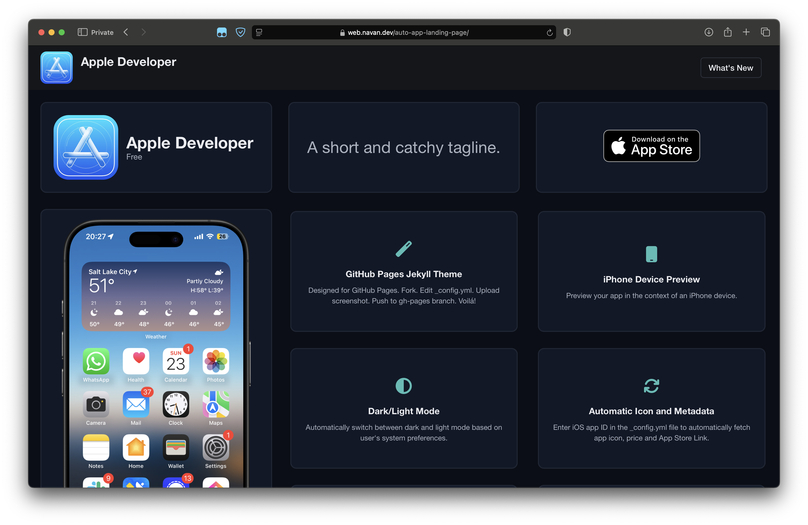
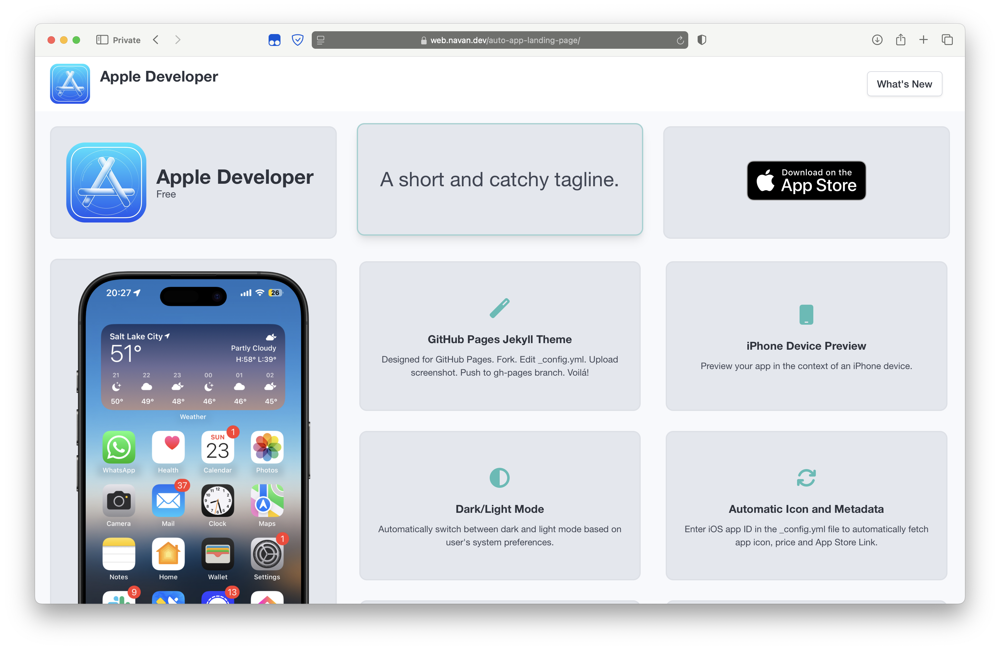
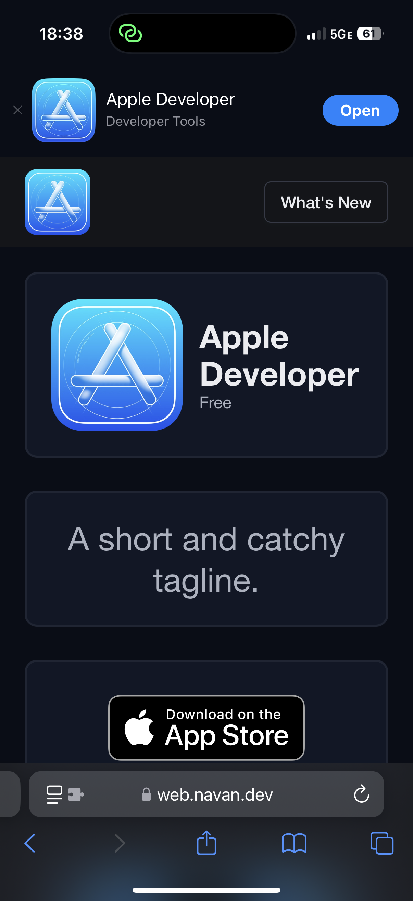

# Auto App Landing Page

Based off [emilbaehr/automatic-app-landing-page](https://github.com/emilbaehr/automatic-app-landing-page) but with a Bento Grid UI using BulmaCSS. Really, the only thing that is common between these repos is the config file.

## Screenshots

